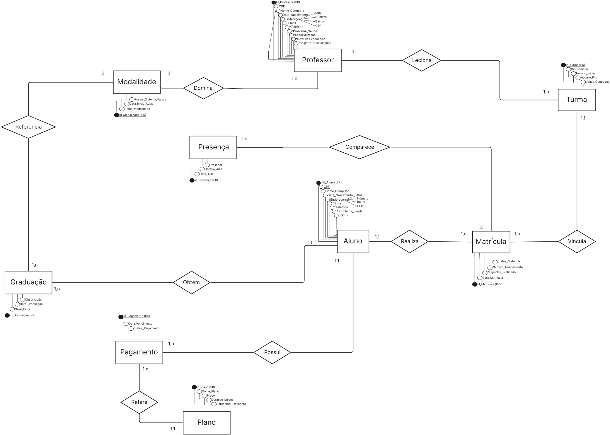

# Entrega 1 - Modelo Conceitual (DER)

## Metadados

* **Nome do Aluno 1:** Felipe Piazza Bononi- **RGM:** 47349361
* **Nome do Aluno 2:** Nickolas Henrique Bezerra - **RGM:** 47685778
* **Nome do Aluno 3:** Pedro Henrique Ruola Coiado - **RGM:** 47589124
* **Nome do Aluno 4:** Raphaela Gonçalves Neves - **RGM:** 47656166
* **Nome do Aluno 5:** Williams Vargas Neves Paoli dos Santos - **RGM:** 47336820
* **Professor/Disciplina:** Cid Rodrigues De Andrade - Modelagem de Banco de Dados

---

# Título 
Modelagem de Banco de Dados Relacional para o Sistema de Gestão da Academia Base Forte Leste.

## Introdução
A academia de artes marciais Base Forte Leste enfrenta atualmente uma crise operacional decorrente da ausência de um sistema informatizado de gestão. Todo o controle administrativo é feito por meio de fichas de papel preenchidas manualmente no ato da matrícula e por tratativas informais via WhatsApp, sem qualquer padronização ou centralização das informações. Essa fragilidade estrutural gera três problemas críticos para o negócio: atrasos recorrentes no pagamento das mensalidades, que vencem todo 5º dia útil sem que a inadimplência seja formalmente registrada ou monitorada; total ausência de controle sobre a frequência dos alunos nas aulas, o que impede qualquer análise objetiva de assiduidade e dificuldade em rastrear o tempo real de treino de cada aluno, informação essencial para embasar a concessão de exames de faixa, hoje decidida apenas pela percepção visual do professor. Diante disso, evidencia-se a necessidade de estruturar um banco de dados relacional capaz de organizar e integrar essas informações.

## Desenvolvimento
O objetivo geral deste trabalho é desenvolver o modelo conceitual (DER) de um banco de dados relacional para dar suporte à gestão administrativa e pedagógica da academia Base Forte Leste, centralizando os dados hoje dispersos entre fichas físicas e conversas informais.

Como objetivos específicos, o grupo busca:

Modelar o cadastro de alunos, contemplando dados pessoais, problema de saúde e situação cadastral (ativo, inativo ou trancado);
Modelar o cadastro de professores, vinculando-os às respectivas modalidades de ensino;
Estruturar o controle de turmas, respeitando o limite de 30 alunos por turma e a associação entre modalidade, horários e professor.
Registrar de forma sistemática os pagamentos de mensalidade, identificando plano contratado e data de pagamento, de modo a permitir o acompanhamento da inadimplência
Viabilizar o registro diário de frequência dos alunos, criando a base de dados necessária para subsidiar decisões de graduação;
Registrar o histórico de graduações e exames de faixa realizados por cada aluno.
Este trabalho delimita-se à modelagem conceitual do banco de dados, não contemplando sua implementação física nem o desenvolvimento de uma aplicação de software. O escopo abrange exclusivamente os processos de cadastro de alunos, professores e turmas, controle de mensalidades, registro de frequência e histórico de graduação, por serem os pontos críticos apontados pelo CEO Adalberto na entrevista de campo. Ficam fora do escopo desta entrega questões como a integração futura com sistemas de catraca por reconhecimento facial (prevista apenas como requisito não funcional de compatibilidade futura) e qualquer módulo de venda de produtos ou suplementos, tema descartado ainda na fase de levantamento de requisitos por não fazer parte da demanda original da academia.

## 1\. Caracterização da Organização

* **Nome e natureza da organização:** Base Forte Leste - Academia de Artes Marciais (Gerida pelo CEO Adalberto). É uma organização com fins lucrativos voltada para a prestação de serviços esportivos e ensino de lutas.
* **Contexto e porte:** Organização de pequeno porte. A academia oferece 6 modalidades (Muay Thai, Kickboxing, Jiu-Jitsu, Boxe, Capoeira e No-Gi). As turmas são divididas por horários e possuem um limite de até 30 alunos por turma.
* **Problemas e necessidades identificados:** Atualmente, a academia enfrenta uma crise operacional devido ao uso exclusivo de fichas de papel e tratativas informais pelo WhatsApp. Os principais problemas são: atrasos recorrentes no pagamento das mensalidades (que vencem todo 5º dia útil e os atrasos não são registrados), total falta de controle sobre a frequência/presença dos alunos e dificuldade para rastrear o tempo de treino real para exames de faixa.
  
* **Justificativa da escolha:** A escolha desta academia fundamenta-se em sua expressiva relevância comunitária na promoção da saúde e no ensino de defesa pessoal. A viabilidade e o aprofundamento dessa seleção decorrem do fato de um dos integrantes da equipe, Nickolas, ser aluno da instituição. Tal condição proporcionou acesso privilegiado à administração, permitindo uma análise precisa dos desafios vivenciados no controle discente, na gestão contratual e no acompanhamento da frequência. A pesquisa de campo, realizada por ele em conjunto com o gestor principal, Adalberto, evidenciou a dependência de formulários impressos para cadastro e a verificação de pagamentos via aplicativos de mensagens. Essa prática sujeita a operação a vulnerabilidades significativas, como a perda de dados essenciais e a ineficácia do controle financeiro. Portanto, o desenvolvimento de um banco de dados mostra-se uma medida imprescindível para assegurar o armazenamento centralizado e seguro das informações, além de prover a infraestrutura necessária para a futura automação do controle de acesso por catraca, conforme almejado pela direção.
  
* **Evidências da organização:
- Endereço completo: Rua Itinguçu, 2345A, Vila Ré, São Paulo – SP
- Responsável: Adalberto (CEO)
- Telefone: (11) 98495-5601 
- E-mail: basefortelesteacademia@gmail.com
- Rede social: Instagram @basefortelesteacademia

  * *Entrevista de Campo:* Realizada presencialmente em 01/09/2026 pelo aluno Nickolas Henrique Bezerra com o CEO Adalberto.

---

## 2\. Processos de Negócio

Mapeamos os três principais fluxos de funcionamento da academia com base na entrevista:

* **Processo de Cadastro e Matrícula:** O aluno preenche uma ficha física de papel com seus dados. A data da matrícula é anotada nessa ficha. Não existe um número de matrícula gerado, a identificação é feita apenas pelo nome/CPF.
* **Processo de Mensalidade:** A academia trabalha com os planos Mensal, Trimestral, Anual e Família. O vencimento é fixo (todo 5º dia útil). O controle é feito de forma manual pelo WhatsApp, registrando apenas a data em que o aluno pagou.
* **Processo de Graduação e Frequência:** Atualmente, a presença nas aulas **não é registrada** de forma alguma. No entanto, a frequência deveria influenciar diretamente na elegibilidade para os exames de faixa (nas modalidades que possuem faixa) ou na análise técnica (como no Boxe). A evolução hoje depende da percepção visual do professor.

---

## 3\. Requisitos do Sistema

### 3.1 Requisitos Funcionais (O que o sistema deve fazer)

* **RF01:** O sistema deve permitir o cadastro de alunos salvando nome, CPF, idade, problema de saúde histórico de treinos anteriores e situação (Ativo, Inativo ou Trancado).
* **RF02:** O sistema deve permitir o cadastro de professores sejam vinculando cada um à sua respectiva modalidade.
* **RF03:** O sistema deve permitir o cadastro de turmas, definindo a modalidade, os dias/horários das aulas e associando um professor responsável.
* **RF04:** O sistema deve registrar os pagamentos das mensalidades, identificando o plano escolhido (mensal, trimestral, anual ou família) e a data do pagamento.
* **RF05:** O sistema deve registrar a frequência diária (presença) dos alunos nas aulas.
* **RF06:** O sistema deve permitir o registro do histórico de graduações e exames de faixa dos alunos com suas respectivas datas.

### 3.2 Requisitos Não Funcionais (Características de qualidade)

* **RNF01 (Integração):** O banco de dados deve ser estruturado de forma a permitir uma futura integração com um sistema de catraca por reconhecimento facial.
* **RNF02 (Segurança):** O sistema deve garantir a privacidade dos dados sensíveis dos alunos (como CPF e Problemas de saúde).
* **RNF03 (Vencimento Fixo):** Toda mensalidade possui como data padrão de vencimento o quinto dia útil de cada mês.
* **RNF04 (Limite de Alunos):** Uma turma não pode ultrapassar o limite máximo de 30 (trinta) alunos matriculados.
* **RNF05 (Exclusividade do Professor):** Um professor só pode ser associado e ministrar aulas na modalidade em que possui propriedade/especialização.
* **RNF06 (Trancamento por Lesão):** O aluno pode alterar seu status para "Trancado" caso sofra uma lesão, interrompendo temporariamente a cobrança ou contagem de tempo.

---

## 4\. Regras de Negócio (Restrições e regras de funcionamento)

 Um aluno pode praticar mais de uma modalidade, limitado apenas por sua disponibilidade de horário (relação N:N entre Aluno e Turma, mediada pela Matrícula).
- Um aluno só pode ter o status "trancado" em caso de lesão comprovada; o atributo de status exige um motivo de trancamento associado.
- O status do aluno segue um domínio fechado de valores: *ativo* (mensalidade em dia), *inativo* ou *trancado* (por lesão).
- Cada professor leciona exclusivamente em sua modalidade de especialização (restrição de integridade entre Usuário, no papel de Professor, e Modalidade).
- Uma modalidade pode ter várias turmas, divididas por horário e dia da semana.
- Uma turma não pode receber novas matrículas ao atingir 30 alunos.
- O "instrutor auxiliar" não é uma entidade própria: é um papel que um Aluno assume dentro de uma turma, condicionado à sua graduação na prática, o aluno mais graduado daquela turma/modalidade, que auxilia o professor responsável.
- A data de matrícula é sempre registrada no cadastro (atributo obrigatório).
- Existem quatro planos de mensalidade (mensal, trimestral, anual e família), cada um com preços e condições próprias.
- Descontos são vinculados ao plano contratado, nunca ao aluno isoladamente.
- O vencimento da mensalidade ocorre sempre no quinto dia útil do mês
- Se o aluno ultrapassar a data de vencimento sem confirmação de pagamento, o acesso à academia é bloqueado.

---

## 5\. Dicionário de Dados Conceitual (Preliminar)

Abaixo está o dicionário de dados completo em uma imagem **clicável**, com todas as entidades e atributos que constam no Diagrama Entidade-Relacionamento (Seção 7):

---

## 6\. Modelagem Conceitual

### Entidades reconhecidas e justificativas:

* **ALUNO:** Necessária para armazenar os dados pessoais, técnicos e a situação cadastral de quem treina.
* **PROFESSOR:** Registra quem ministra as aulas. Importante para o controle de turmas (já que cada turma tem um professor por modalidade).
* **TURMA:** Entidade que organiza o cronograma de aulas, limitando a 30 alunos e vinculando a modalidade e os horários.
* **PAGAMENTO:** Entidade essencial para resolver o problema de inadimplência, registrando as datas de pagamento e os planos.
* **PRESENCA:** Criada para suprir a necessidade de controle de frequência, registrando os dias em que o aluno treinou para fins de graduação.

### Relacionamentos principais:

* **ALUNO possui PAGAMENTO (1,1 para 0,N):** Um pagamento pertence a um único aluno. Um aluno terá vários pagamentos ao longo do tempo.
* **PROFESSOR rege TURMA (1,1 para 0,N):** Cada turma precisa de um professor responsável.
* **TURMA possui ALUNOS (1,N para 0,N):** Uma turma tem vários alunos (máximo 30) e um aluno pode participar de mais de uma turma/modalidade.

---

## 7\. Diagrama Entidade-Relacionamento (DER)

---

## 8\. Justificativa Técnica

Como o grupo é iniciante na disciplina, optamos por uma abordagem direta e focada nos problemas críticos relatados pelo CEO Adalberto: mensalidades e frequência. Criamos a entidade **PRESENCA** separada do **ALUNO** porque mapeamos que a frequência é o dado que o professor precisa para avaliar a troca de faixa. Se guardássemos apenas a "última presença" no cadastro do aluno, a academia continuaria sem o histórico necessário para os certificados de graduação. A separação das entidades garante que o banco de dados resolva a desorganização atual sem inflar a complexidade do modelo nesta primeira entrega.

---

## 9\. Uso de Inteligência Artificial

*(Documentação obrigatória sobre o uso da IA para organizar o trabalho)*.

|Ferramenta e etapa|Motivação|Prompt(s) utilizados / Resposta recebida|Fontes consultadas|Trechos rejeitados/corrigidos|Justificativa da escolha final|Reflexão crítica|
|-|-|-|-|-|-|-|
|**ChatGPT** na organização do README.|Estruturar os dados brutos da entrevista de campo no formato do template exigido.|*Prompt:* "Ajuste o template com base no questionário da academia..."|Questionário de Levantamento de Requisitos preenchido pelo grupo.|Foram removidas sugestões automáticas da IA que envolviam módulos complexos de vendas de produtos (como suplementos), focando apenas no que o CEO pediu (presença e mensalidade).|Mantivemos a estrutura simples para atender estritamente o escopo pedido pelo professor sem complicar a entrega do grupo iniciante.|A IA ajudou a converter as respostas da entrevista em requisitos formais rapidamente, mas a validação humana foi necessária para manter o projeto realista.|
|Ferramenta e etapa|Motivação|Prompt(s) utilizados / Resposta recebida|Fontes consultadas|Trechos rejeitados/corrigidos|Justificativa da escolha final|Reflexão crítica|
|-|-|-|-|-|-|-|
|**Claude** na revisão do Dicionário de Dados (Seção 5) contra o material da disciplina.|Verificar se a tabela do README seguia as convenções ensinadas (tipagem, prefixos) antes de formatar a entrega final.|*Prompt:* "O que está sendo pedido nos pdfs da construção de dados que poderia estar errado no README.md?"|Slides/apostila "Construção de Dicionário de Dados" (02-03e/f) enviados pelo grupo, comparados atributo a atributo com o README.|Nenhuma sugestão foi descartada nessa etapa — todas viraram base para a reformulação seguinte (coluna de tipo, prefixos NM_/DT_/ID_/TP_/IN_, padronização do CPF entre entidades).|O grupo decidiu montar o dicionário definitivo em HTML já incorporando essas correções.|A IA identificou lacunas técnicas comparando dois documentos, mas nessa etapa ainda não tinha acesso ao exemplo oficial (02-03g); por isso a primeira versão gerada não seguia o padrão exato pedido pelo professor e precisou ser refeita.|
|**Claude** na geração do arquivo HTML do Dicionário de Dados (Seção 5).|O esqueleto da entrega exige o dicionário em HTML anexado ao repositório (não markdown no README).|*Prompt:* "Pode montar, deixe-me ver como ficaria" e, depois, "Podemos reformular o HTML inteiro para o estilo ficar próximo do pdf [02-03g]?"|PDF de exemplo oficial da disciplina (02-03g_Exemplo_Dicionario_Dados.pdf — caso do Prontuário Eletrônico) e o README atualizado do grupo, com as regras de negócio e cardinalidades trazidas por uma colega.|A primeira versão do HTML (layout livre, com cores, sem seguir o exemplo oficial) foi descartada. O modelo também foi ajustado no processo: PLANO passou a ser entidade própria (antes era só um campo de texto em PAGAMENTO), PRESENÇA passou a referenciar MATRÍCULA em vez de aluno/turma diretamente, e PROFESSOR passou a ter FK para MODALIDADE.|O grupo manteve as correções estruturais por resolverem melhor as regras de negócio da Seção 4, e manteve o layout fiel ao exemplo pedido pelo professor (notação formal, tabela por entidade, "Leitura", índices).|Ao revisar o material de construção do dicionário de dados, é confirmado nos documentos que é explicitamente necessário haver a camada física (tipo de dado, tamanho, índices), então a mesma foi incluída no HTML final para atender integralmente ao que foi solicitado.|

