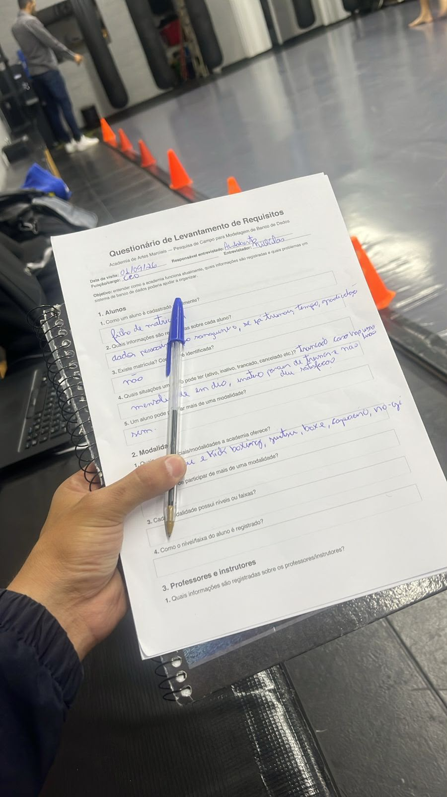

# Entrega 1 - Modelo Conceitual (DER)

## Metadados

* **Nome do Aluno 1:** Felipe Piazza Bononi- **RGM:** 47349361
* **Nome do Aluno 2:** Nickolas Henrique Bezerra - **RGM:** 47685778
* **Nome do Aluno 3:** Pedro Henrique Ruola Coiado - **RGM:** 47589124
* **Nome do Aluno 4:** Raphaela Gonçalves Neves - **RGM:** 47656166
* **Nome do Aluno 5:** Williams Vargas Neves Paoli dos Santos - **RGM:** 47336820
* **Professor/Disciplina:** Cid Rodrigues De Andrade - Modelagem de Banco de Dados

---

# Título 
Modelagem de Banco de Dados Relacional para o Sistema de Gestão da Academia Base Forte Leste.

## Introdução
A academia de artes marciais Base Forte Leste enfrenta atualmente uma crise operacional decorrente da ausência de um sistema informatizado de gestão. Todo o controle administrativo é feito por meio de fichas de papel preenchidas manualmente no ato da matrícula e por tratativas informais via WhatsApp, sem qualquer padronização ou centralização das informações. Essa fragilidade estrutural gera três problemas críticos para o negócio: atrasos recorrentes no pagamento das mensalidades, que vencem todo 5º dia útil sem que a inadimplência seja formalmente registrada ou monitorada; total ausência de controle sobre a frequência dos alunos nas aulas, o que impede qualquer análise objetiva de assiduidade e dificuldade em rastrear o tempo real de treino de cada aluno, informação essencial para embasar a concessão de exames de faixa, hoje decidida apenas pela percepção visual do professor. Diante disso, evidencia-se a necessidade de estruturar um banco de dados relacional capaz de organizar e integrar essas informações.

## Desenvolvimento
O objetivo geral deste trabalho é desenvolver o modelo conceitual (DER) de um banco de dados relacional para dar suporte à gestão administrativa e pedagógica da academia Base Forte Leste, centralizando os dados hoje dispersos entre fichas físicas e conversas informais.

Como objetivos específicos, o grupo busca:

Modelar o cadastro de alunos, contemplando dados pessoais, problema de saúde e situação cadastral (ativo, inativo ou trancado);
Modelar o cadastro de professores, vinculando-os às respectivas modalidades de ensino;
Estruturar o controle de turmas, respeitando o limite de 30 alunos por turma e a associação entre modalidade, horários e professor.
Registrar de forma sistemática os pagamentos de mensalidade, identificando plano contratado e data de pagamento, de modo a permitir o acompanhamento da inadimplência
Viabilizar o registro diário de frequência dos alunos, criando a base de dados necessária para subsidiar decisões de graduação;
Registrar o histórico de graduações e exames de faixa realizados por cada aluno.
Este trabalho delimita-se à modelagem conceitual do banco de dados, não contemplando sua implementação física nem o desenvolvimento de uma aplicação de software. O escopo abrange exclusivamente os processos de cadastro de alunos, professores e turmas, controle de mensalidades, registro de frequência e histórico de graduação, por serem os pontos críticos apontados pelo CEO Adalberto na entrevista de campo. Ficam fora do escopo desta entrega questões como a integração futura com sistemas de catraca por reconhecimento facial (prevista apenas como requisito não funcional de compatibilidade futura) e qualquer módulo de venda de produtos ou suplementos, tema descartado ainda na fase de levantamento de requisitos por não fazer parte da demanda original da academia.

## 1\. Caracterização da Organização

* **Nome e natureza da organização:** Base Forte Leste - Academia de Artes Marciais (Gerida pelo CEO Adalberto). É uma organização com fins lucrativos voltada para a prestação de serviços esportivos e ensino de lutas.
* **Contexto e porte:** Organização de pequeno porte. A academia oferece 6 modalidades (Muay Thai, Kickboxing, Jiu-Jitsu, Boxe, Capoeira e No-Gi). As turmas são divididas por horários e possuem um limite de até 30 alunos por turma.
* **Problemas e necessidades identificados:** Atualmente, a academia enfrenta uma crise operacional devido ao uso exclusivo de fichas de papel e tratativas informais pelo WhatsApp. Os principais problemas são: atrasos recorrentes no pagamento das mensalidades (que vencem todo 5º dia útil e os atrasos não são registrados), total falta de controle sobre a frequência/presença dos alunos e dificuldade para rastrear o tempo de treino real para exames de faixa.
  
* **Justificativa da escolha:** A escolha desta academia fundamenta-se em sua expressiva relevância comunitária na promoção da saúde e no ensino de defesa pessoal. A viabilidade e o aprofundamento dessa seleção decorrem do fato de um dos integrantes da equipe, Nickolas, ser aluno da instituição. Tal condição proporcionou acesso privilegiado à administração, permitindo uma análise precisa dos desafios vivenciados no controle discente, na gestão contratual e no acompanhamento da frequência. A pesquisa de campo, realizada por ele em conjunto com o gestor principal, Adalberto, evidenciou a dependência de formulários impressos para cadastro e a verificação de pagamentos via aplicativos de mensagens. Essa prática sujeita a operação a vulnerabilidades significativas, como a perda de dados essenciais e a ineficácia do controle financeiro. Portanto, o desenvolvimento de um banco de dados mostra-se uma medida imprescindível para assegurar o armazenamento centralizado e seguro das informações, além de prover a infraestrutura necessária para a futura automação do controle de acesso por catraca, conforme almejado pela direção.
  
* **Evidências da organização**:
- Endereço completo: Rua Itinguçu, 2345A, Vila Ré, São Paulo – SP
- Responsável: Adalberto (CEO)
- Telefone: (11) 98495-5601 
- E-mail: basefortelesteacademia@gmail.com
- Rede social: Instagram @basefortelesteacademia
- Levantamento de Requisitos feito pelo integrante Nickolas: [Levantamento de Requisitos](levantamento_requisitos.pdf)

  * *Entrevista de Campo:* Realizada presencialmente em 01/09/2026 pelo aluno Nickolas Henrique Bezerra com o CEO Adalberto.

   <a href="./panfleto.jpeg"><a/> 

---

## 2\. Processos de Negócio

Mapeamos os três principais fluxos de funcionamento da academia com base na entrevista:

* **Processo de Cadastro e Matrícula:** O aluno preenche uma ficha física de papel com seus dados. A data da matrícula é anotada nessa ficha. Não existe um número de matrícula gerado, a identificação é feita apenas pelo nome/CPF.
* **Processo de Mensalidade:** A academia trabalha com os planos Mensal, Trimestral, Anual e Família. O vencimento é fixo (todo 5º dia útil). O controle é feito de forma manual pelo WhatsApp, registrando apenas a data em que o aluno pagou.
* **Processo de Graduação e Frequência:** Atualmente, a presença nas aulas **não é registrada** de forma alguma. No entanto, a frequência deveria influenciar diretamente na elegibilidade para os exames de faixa (nas modalidades que possuem faixa) ou na análise técnica (como no Boxe). A evolução hoje depende da percepção visual do professor.

---

## 3\. Requisitos do Sistema

### 3.1 Requisitos funcionais

- RF01 - Gestão de Cadastro de Alunos: 

        O sistema deve permitir o cadastro e a manutenção dos dados dos alunos, armazenando o nome, CPF, 
        data de nascimento, problemas de saúde, histórico de treinos anteriores e o status de vínculo (Ativo, Inativo ou Trancado).

- RF02 - Cadastro e Especialização de Professores: 

        O sistema deve permitir o cadastro dos professores da academia, vinculando obrigatoriamente cada docente à sua respetiva modalidade de atuação.

- RF03 - Estruturação de Turmas e Horários: 

        O sistema deve permitir a criação de turmas, definindo a qual modalidade pertencem, 
        os dias e horários das aulas, e associando um professor responsável.

- RF04 - Gestão Financeira e Mensalidades: 

        O sistema deve registar a geração e o pagamento das faturas de mensalidade, identificando qual
        foi o plano contratado pelo aluno (Mensal, trimestral, anual ou família) e a data exata da liquidação.

- RF05 - Controle Diário de Presença:

        O sistema deve registar a frequência (presença) dos alunos de forma diária em cada aula que frequentam.

- RF06 - Registo Histórico de Graduação: 
        
        O sistema deve permitir documentar o avanço dos alunos através do registo do histórico de
        graduações e exames de faixa, guardando as datas de cada conquista.

### 3.2 Requisitos não funcionais:

- RNF01 - Integração Biométrica (Escalabilidade): 
        
        O banco de dados deve ser arquitetado de forma a suportar uma futura integração com hardware de
        catraca de acesso acionado por reconhecimento facial.

- RNF02 - Segurança e Privacidade (LGPD): 
    
        O sistema deve garantir o sigilo de dados sensíveis dos alunos (especificamente o CPF e os registos de problemas de saúde).

- RNF03 - Vencimento Fixo Padronizado: 
    
        Independentemente da data de matrícula, o motor financeiro deve padronizar o vencimento
        de todas as mensalidades para o quinto dia útil de cada mês.

- RNF04 - Limite Operacional de Alunos: 
    
        O sistema deve impedir tecnicamente que uma turma ultrapasse o teto máximo de 30 (trinta) alunos simultâneos.

- RNF05 - Exclusividade de Ensino do Professor: 
    
        Uma barreira sistémica deve garantir que um professor seja associado apenas a turmas da modalidade na qual é especialista.

- RNF06 - Regras Estritas de Trancamento: 
    
        O sistema só deve permitir a alteração do status do aluno para "Trancado" mediante o preenchimento
        de uma justificativa médica (lesão), bloqueando a cobrança e a contagem de tempo do plano atual.
---

## 4\. Regras de Negócio (Restrições e regras de funcionamento)

4.1 Regras Operacionais

(Condições e processos de funcionamento estipulados pela administração da academia)

RO01 - Composição e Tipos de Planos Financeiros:

    A Regra: A academia comercializa os seus serviços sob quatro categorias de contratos fechados: Mensal, Trimestral, Anual e Família.

    Impacto no Sistema: Esta regra define um domínio fechado de opções para a tabela MATRICULA. O sistema deve utilizar esse plano
    para calcular automaticamente a geração das faturas na tabela MENSALIDADE e aplicar os descontos correspondentes a cada pacote.

RO02 - Padronização do Vencimento de Mensalidades:

    A Regra: Independentemente do dia em que o aluno realizou a sua matrícula, a data de vencimento da mensalidade é padronizada 
    para o 5º (quinto) dia útil de cada mês.

    Impacto no Sistema: O sistema não utilizará datas dinâmicas (ex: "dia 15 de cada mês") para as cobranças. 
    A lógica de negócio precisará de calcular sistemicamente qual é o 5º dia útil do mês vigente para preencher o atributo data_vencimento.

RO03 - Obrigatoriedade de Frequência para Graduação:

    A Regra: O aluno só pode ser submetido ao exame de mudança de faixa se possuir um histórico consolidado de tempo de treino e 
    presença constante nas aulas daquela modalidade.

    Impacto no Sistema: O sistema deverá realizar um COUNT (contagem) dos registos da tabela PRESENCA de um aluno antes de habilitar a
    inserção de um novo registo na tabela GRADUACAO.

RO04 - Papel do Instrutor Auxiliar (Sem Entidade Própria):

    A Regra: O "instrutor auxiliar" não é um funcionário contratado e, portanto, não possui uma tabela própria no banco de dados. 
    Ele é um aluno veterano (de alta graduação) que auxilia o professor titular.

    Impacto no Sistema: Evita redundância de dados. O controlo sistémico de quem é o instrutor da turma será feito através de um
    relacionamento ou de uma flag de "cargo" a apontar diretamente para um registo já existente na tabela ALUNO.

RO05 - Exceção no Sistema de Avaliação (Regra do Boxe):

    A Regra: Diferente do Jiu-Jitsu ou do Muay Thai, a modalidade de Boxe não utiliza um sistema de graduação por faixas. 
    A evolução é medida exclusivamente por tempo e análise técnica.

    Impacto no Sistema: A tabela MODALIDADE possui um atributo booleano (possui_exame_faixa). Quando esta flag for falsa, 
    o sistema isentará os alunos daquela turma das validações de exames da tabela GRADUACAO.

4.2 Restrições Organizacionais

(Limitações físicas, lógicas e políticas que impõem barreiras ao modelo de dados)

RE01 - Capacidade Máxima e Teto Operacional de Turmas:

    A Restrição: Por limitações de espaço físico e para garantir a qualidade do ensino, nenhuma turma pode ultrapassar a marca de 30 (trinta) alunos em simultâneo.

    Por que importa: É uma restrição de integridade fundamental. O banco de dados precisará de contar com uma trava sistémica 
    (trigger ou validação de aplicação) que bloqueie a vinculação de um novo aluno a uma TURMA se a contagem de matrículas ativas daquela aula chegar a 30.

RE02 - Condicionalidade Médica para Trancamento:

    A Restrição: O congelamento de uma matrícula (trancamento) é proibido por motivos pessoais ou viagens, sendo sistemicamente
    libertado apenas sob justificativa de lesão física ou atestado de saúde.

    Por que importa: Protege a academia contra a evasão de receita. O sistema deve exigir a inclusão de um "motivo de afastamento"
    sempre que o estado for alterado para "Trancado".

RE03 - Exclusividade de Especialização Docente:

    A Restrição: Um professor é estritamente proibido de ministrar aulas em modalidades que fujam da sua especialização formal cadastrada.

    Por que importa: Garante a credibilidade marcial da BASE FORTE LESTE. No banco de dados, a tabela de relacionamento entre PROFESSOR e TURMA
    só permitirá a alocação se o atributo da modalidade do professor for idêntico ao da turma escolhida.

RE04 - Integridade do Domínio de Status Cadastral:

    A Restrição: O estado do vínculo de um aluno com a instituição deve obedecer a uma categorização rígida: Ativo (pagante regular), 
    Inativo (inadimplente ou cancelado) ou Trancado (afastado por lesão).

    Por que importa: Impede dados inconsistentes ou estados inexistentes (como "semi-ativo" ou "a aguardar"). O atributo de status no banco terá
    uma cláusula restritiva (restrição CHECK ou ENUM) a limitar as entradas a esses três valores precisos.

RE05 - Bloqueio Automatizado de Catraca por Inadimplência:

    A Restrição: O acesso físico às dependências de treino é imediatamente revogado se houver uma mensalidade não quitada após o seu respetivo vencimento (5º dia útil).

    Por que importa: É a solução direta para a principal "crise operacional" apontada pelo CEO Adalberto. A consulta (SELECT) que
    liberta a catraca fará um cruzamento (JOIN) em tempo real entre o ALUNO, a MATRICULA e a MENSALIDADE. Se houver status_pagamento = 'Pendente'
    com a data vencida, o sistema retornará 'Bloqueado', a barrar o aluno e a impedir o registo na tabela de PRESENCA.

---

---

## 5\. Dicionário de Dados Conceitual (Preliminar)

Abaixo está o dicionário de dados completo em uma imagem **clicável**, com todas as entidades e atributos que constam no Diagrama Entidade-Relacionamento (Seção 7):

---

## 6\. Modelagem Conceitual

### Entidades reconhecidas e justificativas:

* **ALUNO:** Necessária para armazenar os dados pessoais, técnicos e a situação cadastral de quem treina.
* **PROFESSOR:** Registra quem ministra as aulas. Importante para o controle de turmas (já que cada turma tem um professor por modalidade).
* **TURMA:** Entidade que organiza o cronograma de aulas, limitando a 30 alunos e vinculando a modalidade e os horários.
* **PAGAMENTO:** Entidade essencial para resolver o problema de inadimplência, registrando as datas de pagamento e os planos.
* **PRESENCA:** Criada para suprir a necessidade de controle de frequência, registrando os dias em que o aluno treinou para fins de graduação.

### Relacionamentos principais:

* **ALUNO possui PAGAMENTO (1,1 para 0,N):** Um pagamento pertence a um único aluno. Um aluno terá vários pagamentos ao longo do tempo.
* **PROFESSOR rege TURMA (1,1 para 0,N):** Cada turma precisa de um professor responsável.
* **TURMA possui ALUNOS (1,N para 0,N):** Uma turma tem vários alunos (máximo 30) e um aluno pode participar de mais de uma turma/modalidade.

---

## 7\. Diagrama Entidade-Relacionamento (DER)

---

## 8\. Justificativa Técnica

Como o grupo é iniciante na disciplina, optamos por uma abordagem direta e focada nos problemas críticos relatados pelo CEO Adalberto: mensalidades e frequência. Criamos a entidade **PRESENCA** separada do **ALUNO** porque mapeamos que a frequência é o dado que o professor precisa para avaliar a troca de faixa. Se guardássemos apenas a "última presença" no cadastro do aluno, a academia continuaria sem o histórico necessário para os certificados de graduação. A separação das entidades garante que o banco de dados resolva a desorganização atual sem inflar a complexidade do modelo nesta primeira entrega.

---

## 9. Uso de Inteligência Artificial

*(Documentação obrigatória sobre o uso da IA para organizar o trabalho)*.

| Ferramenta e Etapa | Motivação | Prompt(s) Utilizados / Resposta | Fontes Consultadas | Trechos Rejeitados / Corrigidos | Justificativa da Escolha Final | Reflexão Crítica |
| :--- | :--- | :--- | :--- | :--- | :--- | :--- |
| **ChatGPT**  Organização do README. | Estruturar os dados brutos da entrevista de campo no formato do template exigido. | *"Ajuste o template com base no questionário da academia..."* | Questionário de Levantamento de Requisitos (versão do grupo). | Foram removidas sugestões automáticas da IA que envolviam módulos complexos de vendas de produtos (como suplementos), focando apenas no que o CEO pediu (presença e mensalidade). | Mantivemos a estrutura simples para atender estritamente o escopo pedido pelo professor sem complicar a entrega do grupo iniciante. | A IA ajudou a converter as respostas da entrevista em requisitos formais rapidamente, mas a validação humana foi necessária para manter o projeto realista. |
| **Claude**  Revisão do Dicionário de Dados (Seção 5). | Verificar se a tabela do README seguia as convenções ensinadas (tipagem, prefixos) antes de formatar a entrega final. | *"O que está sendo pedido nos pdfs da construção de dados que poderia estar errado no README.md?"* | Slides/apostilas da disciplina (02-03e/f) sobre Dicionário de Dados. | Nenhuma sugestão foi descartada nessa etapa — todas viraram base para a reformulação seguinte (coluna de tipo, prefixos `NM_`/`DT_`/`ID_`/`TP_`/`IN_`, padronização do CPF entre entidades). | O grupo decidiu montar o dicionário definitivo em HTML já incorporando essas correções. | A IA identificou lacunas técnicas comparando os documentos, mas sem o exemplo oficial (02-03g), a primeira versão não seguia o padrão exato do professor e precisou ser refeita. |
| **Claude**  Geração do HTML do Dicionário de Dados (Seção 5). | O esqueleto da entrega exige o dicionário em HTML anexado ao repositório (não markdown no README). | *"Pode montar, deixe-me ver como ficaria"*   e depois:  *"Podemos reformular o HTML inteiro para o estilo ficar próximo do pdf [02-03g]?"* | Exemplo oficial em PDF (02-03g) e README atualizado. | A primeira versão do HTML (layout livre, com cores) foi descartada.  **Ajustes de modelo:** PLANO virou entidade própria; PRESENÇA passou a referenciar MATRÍCULA; PROFESSOR passou a ter FK para MODALIDADE. | Mantivemos as correções por resolverem melhor as regras da Seção 4, e o layout fiel ao exemplo pedido (notação formal, tabela por entidade, índices, camada física de tipos e tamanhos). | Ao revisar o material, confirmou-se que a camada física era explicitamente necessária. Ela foi incluída no HTML final para atender integralmente ao que foi solicitado. |
| **Claude**  Texto de introdução e desenvolvimento (1º Texto). | Criar um texto formal com base nas crises operacionais seguindo os passos do escopo do professor. | *"Preciso que você faça um texto de introdução sobre meu trabalho de modelagem de banco de dados seguindo o levantamento de requisitos, use esses parâmetros: Problema, objetivos e delimitação."* | Levantamento de requisitos e "esqueleto_de_entrega" oficial. | O texto gerado identificava erroneamente o "instrutor" como uma entidade. O texto foi reformulado deixando apenas o **Professor** como entidade, conforme nosso levantamento. | O grupo optou por um texto mais formal, seguindo estritamente as regras do levantamento de requisitos. | A IA ajudou com a formalidade do texto, e o próprio erro ao sugerir "instrutor" como entidade ajudou o grupo a identificar e corrigir incoerências no trabalho. |
